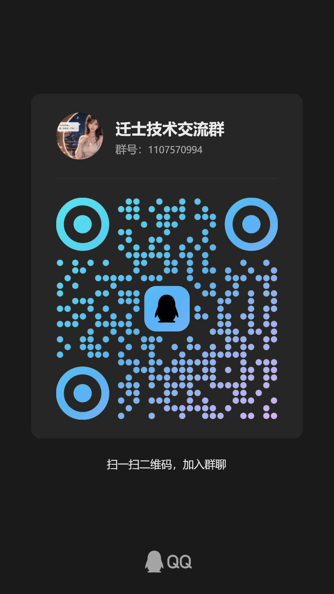

[English](README.md) | [中文](README.zh-CN.md)

# SCOPE Image Orchestrator

A Codex skill for structured image-generation orchestration.

It converts image requests into explicit constraints, route-aware optimization,
generation calls, optional visual checks, targeted repair loops, and reproducible artifacts.

This is an independent practical adaptation inspired by the SCOPE paper.

## Highlights

- Structured prompt decomposition.
- Route-aware prompt optimization.
- Multi-provider API adapter layer.
- Optional reference-image analysis.
- Optional visual audit and targeted repair loop.
- Batch and dry-run tooling for repeatable tests.

## Paper

- **SCOPE: Structured Decomposition and Conditional Skill Orchestration for Complex Image Generation**
- arXiv: https://arxiv.org/abs/2605.08043
- HTML: https://arxiv.org/html/2605.08043v1
- Project: https://nopnor.github.io/SCOPE/

## Quick start

Copy the environment template and fill in your own endpoint and key:

```bash
cp references/.env.example .env
```

Dry-run without calling an image API:

```bash
python scripts/generate_single_v2.py \
  --env-file .env \
  --user-prompt "your image request" \
  --out-dir scope_runs/example \
  --dry-run
```

Generate one image:

```bash
python scripts/generate_single_v2.py \
  --env-file .env \
  --user-prompt "your image request" \
  --out-dir scope_runs/example
```

List command helpers:

```bash
python scripts/scope_commands.py commands
```

## Configuration

Use `references/.env.example` as the public configuration template.

Supported adapter families:

- OpenAI-compatible text, vision, and image APIs.
- Google Gemini-compatible text, vision, and image APIs.
- Generic JSON wrapper endpoints.

For detailed request shapes, see:

- `references/api-providers.md`
- `references/provider-config.example.json`

## Presets

The unified preset library is:

```text
references/scope-preset-library.json
```

Preset ideas are distilled from public prompt examples and rewritten into compact
route-level controls. The repository is not intended to redistribute verbatim
third-party prompt bodies.

Current route families include:

```text
portrait, magazine, poster, cosplay, interior, product, bathroom,
idiom_cinema, documentary, strategy_overhead, anime_cel
```

## Validation

Run the offline release check before publishing changes:

```bash
python scripts/run_release_checks.py --out-dir ./.codex_tmp/scope_release_checks
```

This check is local only and does not call real APIs.

Release evidence bundle:

- [release-readiness-2026-06-06.md](docs/release-readiness-2026-06-06.md)

## Output artifacts

```text
scope_runs/<task>/
  user_request.txt
  route.json
  optimized_prompt.json
  generation_prompt.txt
  image_result.attempt_N.json
  visual_audit.attempt_N.json
  image.png
  final_summary.json
```

## Community

Friendly support: Linux Do Community

QQ group: `1107570994`


